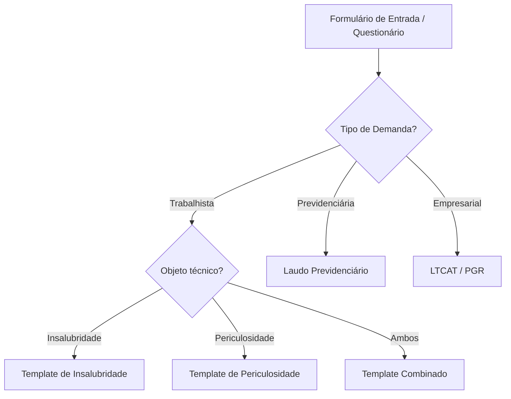

# Regras Condicionais de Negócio para Geração de Laudos SST

Este documento representa regras **de composição e sugestão** encontradas durante a fase de pesquisa. Elas não devem ser tratadas como conclusão automática nem substituir avaliação profissional.

## 1. Árvore de decisão conceitual

## 2. Inclusão condicional de capítulos

- Quando o material de entrada menciona **ruído**, o sistema pode sugerir a inclusão do capítulo correspondente, metodologia aplicável e campos de medição.
- Quando houver indícios de **agentes químicos**, pode sugerir capítulo específico e campos para EPIs/EPCs e evidências.
- Quando houver contexto de **agentes biológicos**, pode sugerir seção própria e documentos necessários para análise.
- Quando houver contexto de **periculosidade**, pode sugerir seções e dados necessários para avaliação do enquadramento.

## 3. Princípio de segurança

As regras deste laboratório servem para **montagem do esqueleto, alertas e sugestões**. A conclusão depende das evidências, medições, normas aplicáveis e julgamento do profissional habilitado.
