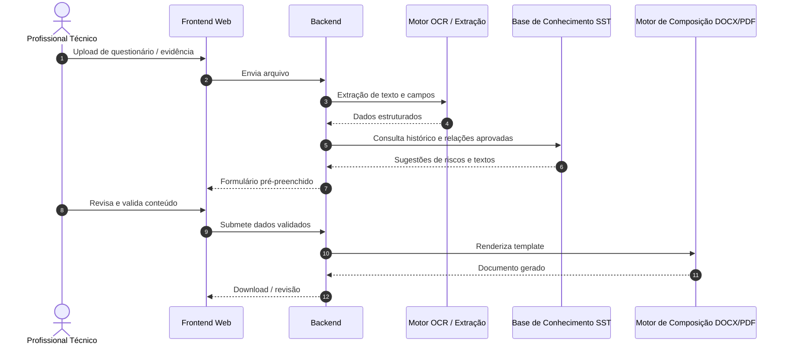

# Fluxo Ponta a Ponta do Sistema Web de Laudos SST

```mermaid
sequenceDiagram
    autonumber
    actor Prof as Profissional Técnico
    participant WebUI as Frontend Web
    participant API as Backend
    participant OCR as Motor OCR / Extração
    participant DB as Base de Conhecimento SST
    participant Engine as Motor de Composição DOCX/PDF

    Prof->>WebUI: Upload de questionário / evidência
    WebUI->>API: Envia arquivo
    API->>OCR: Extração de texto e campos
    OCR-->>API: Dados estruturados
    API->>DB: Consulta histórico e relações aprovadas
    DB-->>API: Sugestões de riscos e textos
    API-->>WebUI: Formulário pré-preenchido
    Prof->>WebUI: Revisa e valida conteúdo
    WebUI->>API: Submete dados validados
    API->>Engine: Renderiza template
    Engine-->>API: Documento gerado
    API-->>WebUI: Download / revisão
```

O princípio central é manter o profissional no circuito de validação antes de qualquer conclusão ou documento final.
